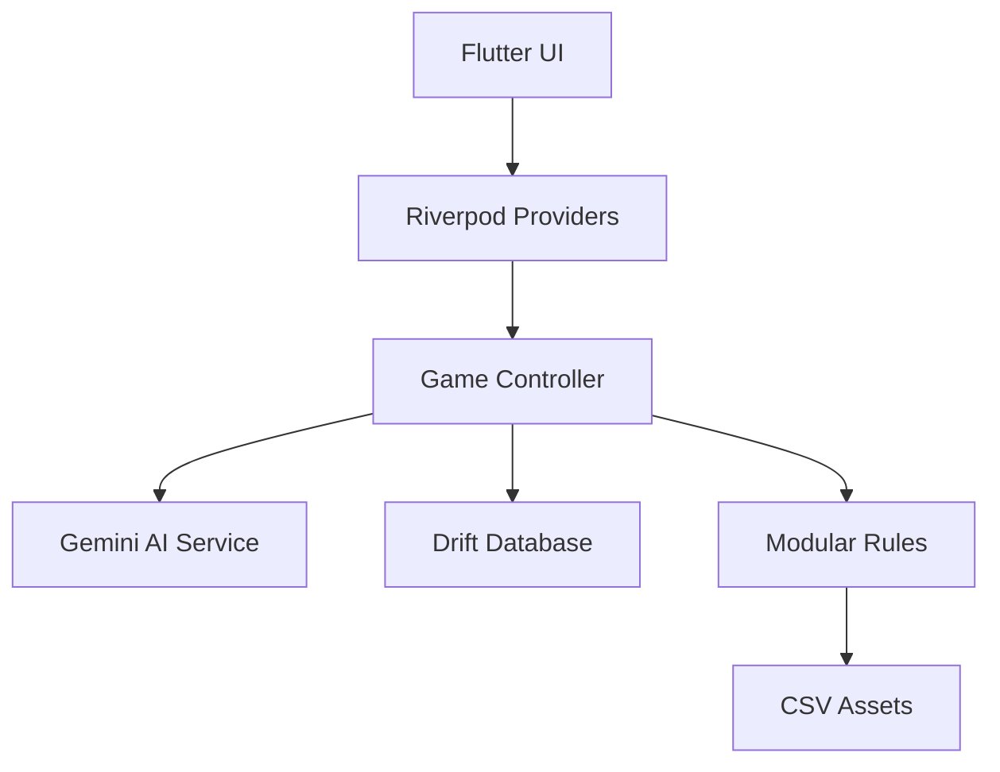

# TTRPG Sim

An AI-powered tabletop role-playing game engine built with Flutter. This application uses Google's Gemini AI to serve as a dynamic Game Master, enabling solo or collaborative TTRPG sessions with intelligent narrative generation, character management, and a modular d20 rule system.

## Features

- **AI Game Master** - Powered by Google Gemini for dynamic storytelling and responsive gameplay
- **Modular d20 System** - Customizable rules defined via CSV files for genres, species, skills, and more
- **Character Creation** - Multi-step character builder with species, origin, traits, and magic pillars
- **World Management** - Create and manage multiple fantasy worlds with unique genres
- **Magic System** - Five universal magic pillars (Matter, Energy, Force, Mind, Life) with genre-specific archetypes
- **Chat Interface** - Real-time AI conversation with dice rolling and game state updates
- **Character Sheet** - Full stats, inventory management, and grimoire for magic users
- **Atlas System** - Location tracking and generation within game worlds

## Tech Stack

| Layer | Technology |
|-------|------------|
| Framework | Flutter 3.2+ |
| State Management | Riverpod |
| Database | Drift (SQLite) |
| AI Integration | Google Generative AI (Gemini) |
| Data Models | Freezed + JSON Serializable |

## Project Structure

```
lib/
├── core/
│   ├── database/       # Drift database, migrations, DAOs
│   ├── models/         # Data models (Character, World, Rules)
│   ├── rules/          # Modular rules controller
│   ├── services/       # AI service, PDF export, dice utils
│   └── providers.dart  # Riverpod providers
├── features/
│   ├── campaign/       # Campaign/session management
│   ├── character/      # Character sheet & details
│   ├── chat/           # AI chat interface
│   ├── creation/       # Character creation steps
│   ├── game/           # Core game controller
│   ├── menu/           # Main menu
│   ├── settings/       # API key & preferences
│   └── world/          # World management
└── main.dart

assets/system/          # CSV rule definitions
├── Genres.csv          # Genre definitions (Fantasy, Superhero, Horror)
├── Species.csv         # Playable species per genre
├── Origins.csv         # Character backgrounds
├── Attributes.csv      # Core attributes
├── Skills.csv          # Skills and proficiencies
├── Feats.csv           # Character feats
├── Traits.csv          # Character traits
├── Items.csv           # Equipment and items
└── MagicPillars.csv    # Magic system pillars
```

## Getting Started

### Prerequisites

- Flutter SDK 3.2.0 or higher
- Dart SDK
- Google Gemini API key

### Installation

```bash
# Clone the repository
git clone https://github.com/yourusername/ttrpg_sim.git
cd ttrpg_sim

# Install dependencies
flutter pub get

# Generate code (database, models)
dart run build_runner build --delete-conflicting-outputs

# Run the app
flutter run
```

### Configuration

1. Launch the app and navigate to **Settings**
2. Enter your Gemini API key
3. (Optional) Configure paid API key for enhanced features
4. Create your first world and character!

## Testing

The project includes comprehensive unit tests and BDD-style widget tests:

```bash
# Run all tests
flutter test

# Run with verbose output
flutter test --reporter=expanded
```

### Test Coverage

| Category | Tests | Description |
|----------|-------|-------------|
| Unit Tests | 41 | Database, migrations, AI service, rules parsing |
| BDD/Widget Tests | 35 | Character creation, settings, game flows |
| **Total** | **76** | Full coverage of core functionality |

### Test Structure

```
test/
├── unit/
│   ├── rules/              # CSV parsing, asset verification
│   ├── services/           # Gemini service tests
│   ├── core/               # Database migration tests
│   └── *.dart              # Controller and utility tests
├── bdd/
│   ├── character_creation_flow_test.dart
│   ├── settings_flow_test.dart
│   ├── gameplay_loop_test.dart
│   └── *.dart              # Feature integration tests
├── features/               # Feature-specific widget tests
└── widget/                 # General widget tests
```

## Modular Rules System

Rules are defined in CSV files under `assets/system/`. This allows for easy customization without code changes:

### Adding a New Species

Edit `Species.csv`:
```csv
Name,Description,Genres,Size,Speed,Abilities
"Shadow Elf","Elves adapted to darkness","Fantasy|Horror",Medium,35,"Darkvision|Stealth Bonus"
```

### Adding a New Skill

Edit `Skills.csv`:
```csv
Name,Description,Genres,Attribute,DC
"Hacking","Digital intrusion skills","Cyberpunk|Sci-Fi",Intelligence,15
```

## Architecture



## License

This project is private and not licensed for public distribution.

## Contributing

This is a personal project. For questions or suggestions, please open an issue.
